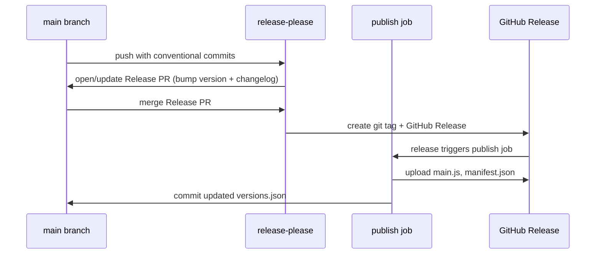

# Format on Save

An Obsidian plugin that runs any external formatter on save. Bring your own tool — Prettier, deno fmt, or anything else that accepts a file path.

## Features

- **Format on save** — automatically runs your configured formatter when a file is modified (debounced)
- **Manual command** — "Format current file" available from the command palette
- **Any formatter** — use whatever CLI tool you prefer with its own config files

## Configuration

| Setting             | Description                                 | Default      | Example                                       |
| ------------------- | ------------------------------------------- | ------------ | --------------------------------------------- |
| Enable              | Toggle auto-format on save                  | `true`       | on/off                                        |
| Formatter command   | Path to the formatter executable            | `""` (empty) | `prettier`, `deno`, `/usr/local/bin/prettier` |
| Formatter arguments | Arguments passed before the file path       | `""` (empty) | `--write`, `fmt`                              |
| Debounce delay (ms) | Wait time after last edit before formatting | `500`        | `500`                                         |

### Examples

**Prettier:**

- Command: `prettier`
- Arguments: `--write`

**deno fmt:**

- Command: `deno`
- Arguments: `fmt`

**oxfmt:**

- Command: `oxfmt`
- Arguments: `--write`

The file's absolute path is appended automatically as the last argument.

Place your formatter's config file (`.prettierrc`, `deno.json`, `.oxfmtrc.json`, etc.) in your vault root or home directory as usual.

## Release workflow

Releases are fully automated via [release-please](https://github.com/googleapis/release-please).

### How to release

1. Merge PRs with [Conventional Commits](https://www.conventionalcommits.org/) into `main`
2. release-please automatically opens (or updates) a Release PR that bumps the version and updates the changelog
3. Merge the Release PR — this creates a git tag and GitHub Release
4. The publish job builds `main.js` and uploads release assets

### Commit conventions

| Prefix                         | Version bump  | Example                           |
| ------------------------------ | ------------- | --------------------------------- |
| `fix:`                         | patch (0.0.x) | `fix: handle empty files on save` |
| `feat:`                        | minor (0.x.0) | `feat: add timeout setting`       |
| `feat!:` or `BREAKING CHANGE:` | major (x.0.0) | `feat!: change settings format`   |

### Release artifacts

Each release includes:

- `main.js` — bundled plugin code
- `manifest.json` — plugin metadata

## Installation

### Manual

1. Build the plugin: `pnpm install && pnpm run build`
2. Copy `main.js` and `manifest.json` to `<vault>/.obsidian/plugins/fmt-on-save/`
3. Reload Obsidian and enable the plugin in **Settings → Community plugins**

## Desktop only

This plugin uses `child_process.exec` to run external commands and is desktop only.
